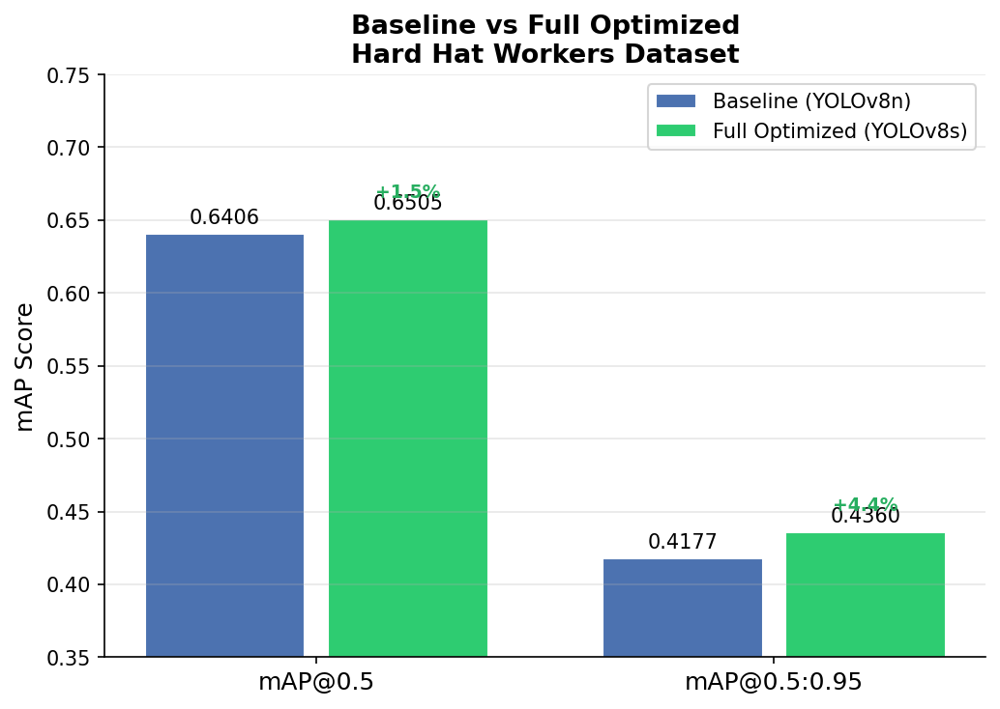
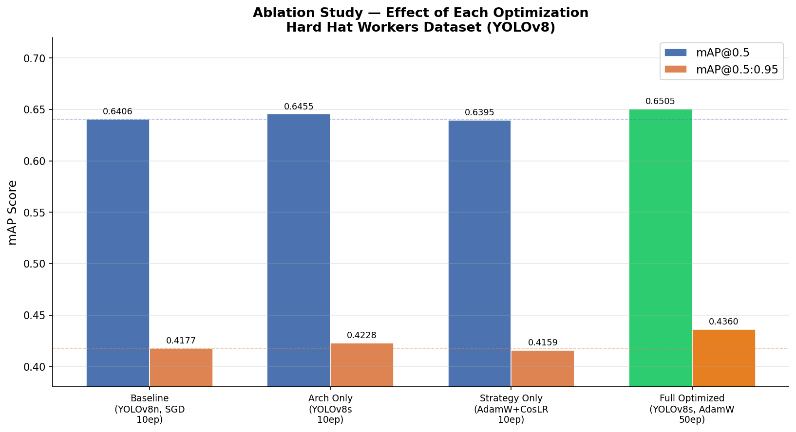

# SP26 Homework 2 — Object Detection
**Course:** Deep Learning, San José State University, Spring 2026  
**Due:** April 17, 2026  

---

## Objective

Explore optimization techniques for 2D object detection.

## Selected Option: Option 1 — Training Optimization

Improve the training process of a 2D object detection model through:

- Modifying the model architecture via configurations (e.g., backbone, neck, head, feature fusion)
- Changing the training strategy (e.g., data augmentation, optimizer, scheduler, loss settings, batch size, image size, transfer learning strategy)

---

## Submission Contents

| File | Description |
|---|---|
| `baseline_train.py` | Baseline YOLOv8n training script |
| `report.md` | Full optimization report with ablation study and COCO-style evaluation results |

---

## Results Summary

### Baseline vs Full Optimized

| Metric | Baseline | Full Optimized | Change |
|---|---|---|---|
| mAP@0.5 | 0.6406 | 0.6505 | **+0.0099 (+1.5%)** |
| mAP@0.5:0.95 | 0.4177 | 0.4360 | **+0.0183 (+4.4%)** |

---

## Ablation Study

Each optimization was tested independently to measure its individual contribution.

| Config | mAP@0.5 | mAP@0.5:0.95 |
|---|---|---|
| Baseline (YOLOv8n, SGD, 10ep) | 0.6406 | 0.4177 |
| + YOLOv8s only (arch change) | 0.6455 | 0.4228 |
| + AdamW + CosLR only (strategy) | 0.6395 | 0.4159 |
| Full Optimized (YOLOv8s, 50ep) | 0.6505 | 0.4360 |

**Key finding:** AdamW + Cosine LR alone slightly underperforms at 10 epochs — these optimizers need more epochs to realize their benefit. Combined with the larger YOLOv8s architecture and 50 epochs, all changes become synergistic and produce the best result.

See `report.md` for full analysis.
